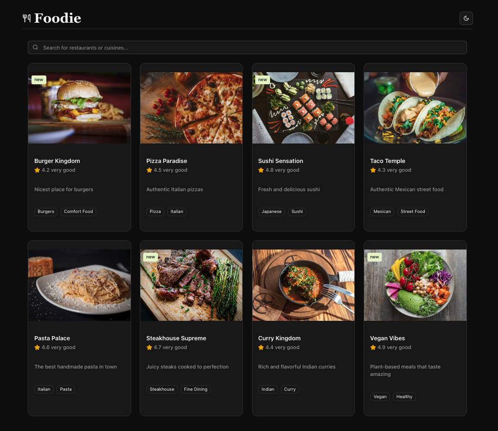

# Foodie

Foodie is a restaurant discovery application built with React, Vite, and Tailwind CSS.



## Features

- Browse a list of restaurants
- View detailed restaurant information
- Toggle between light and dark themes
- Responsive design
- Mock API with JSON Server
- Efficient data handling with React Query

## Installation

1. **Clone the repository:**

   ```bash
   git clone https://github.com/chambits/foodie.git
   cd foodie
   ```

2. **Install dependencies:**

   ```bash
   yarn install
   ```

3. **Start the JSON server:**

   ```bash
   yarn start:json-server
   ```

4. **Run the development server:**

   ```bash
   yarn dev
   ```

## Usage

- Access the app at `http://localhost:5173`
- Use the theme toggle in the header to switch between light and dark modes
- Browse restaurants and view their details

## Technologies Used

- **React**: JavaScript library for building user interfaces
- **Vite**: Fast development build tool
- **Tailwind CSS**: Utility-first CSS framework
- **React Query**: Data fetching and caching library
- **JSON Server**: Mock REST API server
